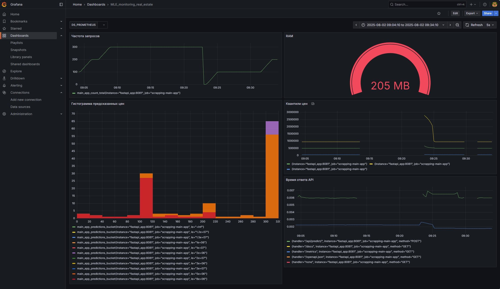

# Мониторинг

Графики на дашборде представляют временные ряды данных, метрики производительности и статистику использования модели.  
Для мониторинга метрик необходимо перейти в Grafana: http://localhost:3000/

## Для мониторинга выбраны метрики нескольких слоев:  

### Инфраструткурный слой:
- Метрика `RAM`:  
    - Потребление памяти — критически важный показатель для стабильности сервиса.  
    - Позволяет обнаружить утечки памяти или неоптимальную работу модели (например, загрузку тяжелых весов при каждом запросе).  

### Метрики реального времени:  
- Метрика `Квантили ответов модели`. Квантили (0.05, 0.5, 0.95) помогают отслеживать:  
    - Сдвиг предсказаний (data drift).  
    - Выбросы (аномально высокие/низкие предсказания).  
    - Стабильность модели (если медиана резко изменилась — это тревожный сигнал).  
- Метрика `Время ответа API` относится к инфраструктурным метрикам(Мониторинг здоровья сервиса) и метрикам производительности(Фиксируется для каждого запроса):  
    - Производительность системы. Рост времени ответа может указывать на: нехватку CPU/RAM, проблемы с сетью, перегруженность БД или внешних сервисов.  
    - Качество ML-модели.
        - Сложность предсказаний (если /api/predict работает медленнее других эндпоинтов — возможно, модель требует оптимизации).
        - Дрейф данных (резкий рост времени обработки может сигнализировать о неожиданных входных данных).  ...

### Метрики прикладного уровня:
- Метрика `Частота запросов`:  
    - Нагрузку на сервис (можно планировать масштабирование).  
    - Эффективность маркетинга (например, всплеск запросов после рекламы).  
    - Аномалии (например, DDoS-атака или сбой в клиентском приложении).  
- Метрика `Гистограмма предсказанных цен`:  
    - Распределение предсказаний (нормальное/аномальное).  
    - Смещение модели (например, если 90% предсказаний в диапазоне 1M–2M, а реальные цены 3M–5M).  
    - Популярные категории недвижимости (можно оптимизировать модель под них).  

